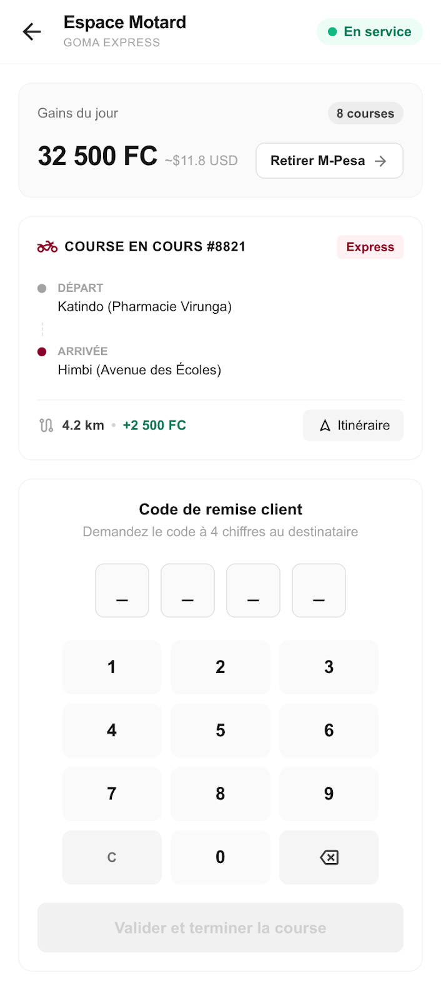

<div align="center">
  

  # ATLAS Driver App (Livreur / Livreur)
  **L'outil ultime pour les livreurs et livreurs du réseau ATLAS à Goma.**

  [](https://flutter.dev)
  [](https://dart.dev)
  []()
  []()
</div>

---

## 📌 À propos

**ATLAS Driver App** est l'application réservée aux coursiers (livreurs) partenaires du réseau ATLAS Goma. Développée en **Flutter**, elle permet aux livreurs de gérer leurs courses, de suivre leurs revenus journaliers, et de valider les livraisons de manière ultrasécurisée via un système de **Code OTP client**.

## ✨ Fonctionnalités Clés

*   💸 **Dashboard des Gains** : Suivi instantané des revenus générés dans la journée et bouton de retrait rapide (M-Pesa, Airtel Money, etc.).
*   🛵 **Course en Cours** : Informations claires sur le point de retrait (ex: Katindo) et de dépôt (ex: Himbi), kilométrage et estimation de gain.
*   🗺️ **Bouton Itinéraire** : Lien direct vers l'application de navigation GPS native du téléphone.
*   🔒 **Clavier Code OTP Sécurisé** : Un pavé numérique intégré permet au livreur de saisir le code de réception à 4 chiffres (fourni par le client) pour débloquer le paiement sous séquestre et clore la course avec succès.

---

## 📸 Capture d'Écran (UI/UX)

Une interface claire, adaptée à un usage en extérieur sur moto.

<div align="center">
  
</div>

---

## 🛠️ Stack Technique

*   **Framework** : [Flutter](https://flutter.dev) (Dart)
*   **Architecture** : MVC / Clean Architecture
*   **Design System** : Minimaliste, contrastes forts pour lecture au soleil.
*   **Polices** : `Inter` (lisibilité) & `Plus Jakarta Sans` (titres).

## 🚀 Installation & Démarrage

1.  **Prérequis** : Avoir installé [Flutter](https://docs.flutter.dev/get-started/install).
2.  **Cloner le dépôt** :
    ```bash
    git clone https://github.com/atheon006/atlas-driver-app.git
    cd atlas-driver-app
    ```
3.  **Installer les dépendances** :
    ```bash
    flutter pub get
    ```
4.  **Lancer l'application** :
    ```bash
    flutter run
    ```

---

<div align="center">
  <p>Conçu pour simplifier la vie des livreurs de Goma avec ❤️</p>
</div>
